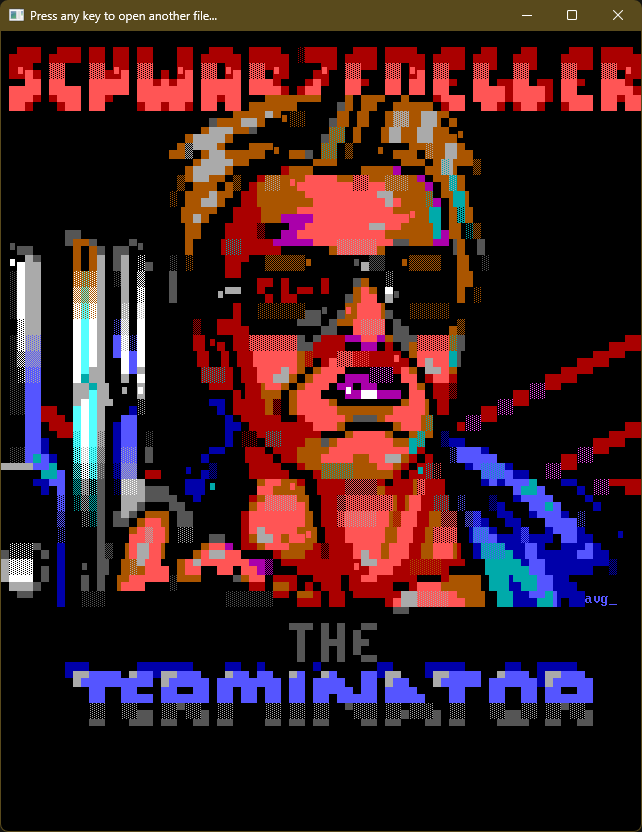

# QB64 ANSI Escape Sequence Emulator

This is an [ANSI Escape Sequence](https://en.wikipedia.org/wiki/ANSI_escape_code) Emulator library written entirely in [QB64](https://qb64.com).





## Goals

- No dependency on third party libraries - OK
- No OS specific code - OK
- Support all meaningful [ANSI Escape Sequences](https://en.wikipedia.org/wiki/ANSI_escape_code) - WIP
- Support all meaningful [ANSI.SYS Escape Sequences](https://en.wikipedia.org/wiki/ANSI.SYS) - WIP
- Support all meaningful non-ANSI escape sequences (e.g. [PabloDraw](https://github.com/cwensley/pablodraw) 24bpp colors) - WIP
- Support embedded [ANSI music](docs/ansimtech.txt) - WIP
- Support [animated ANSI](http://www.roysac.com/ansianim.html) content - WIP
- Support querying width and height of the content in characters - WIP
- Easy plug-&-play API - WIP
- Load and render all [ANS](https://en.wikipedia.org/wiki/ANSI_art), ASC, DIZ, NFO and TXT files in the repository correctly - WIP
- Include a demo viewer to show how to use the library - WIP

## API

```VB
Sub PrintANSI (sANSI As String, nCPS As Long)
```

## Bibliography

- [ANSI Escape Sequences](https://gist.github.com/fnky/458719343aabd01cfb17a3a4f7296797) by Christian Petersen
- [ANSI escape code](https://en.wikipedia.org/wiki/ANSI_escape_code) from Wikipedia
- [ANSI.SYS](https://en.wikipedia.org/wiki/ANSI.SYS) from Wikipedia
- [Console Virtual Terminal Sequences](https://learn.microsoft.com/en-us/windows/console/console-virtual-terminal-sequences) by Microsoft
- [ANSI.SYS Documentation](https://learn.microsoft.com/en-us/previous-versions/tn-archive/cc722862(v=technet.10)) by Microsoft
- [ANSI.SYS Documentation and Reference](http://www.roysac.com/learn/ansisys.html) by Carsten Cumbrowski
- [ANSIPLUS Escape Sequences](http://www.sweger.com/ansiplus/EscSeq.html) by Kristofer Sweger
- [NANSI.SYS Documentation](docs/nansi.txt) by Daniel Kegel
- [NNANSI.COM Documentation](docs/nnansi.txt) by Tom Almy
- [ANSI Color Codes](https://talyian.github.io/ansicolors/) by Jimmy Tang
- [SAUCE – Standard Architecture for Universal Comment Extensions](https://www.acid.org/info/sauce/sauce.htm) by Olivier "Tasmaniac" Reubens / ACiD
- [ANSI Music](docs/ansimtech.txt) by unknown
- Various resources and information from <https://16colo.rs/>, <http://www.roysac.com/> and <https://int10h.org/>

## What can I do with this?

Anything you want! Use it in games, demos or for writing pretty text mode user interfaces and output.

## Notes

- This requires a relatively recent version of [QB64](https://qb64.com); tested with [QB64](https://qb64.com) v2.1.0
- [QuickPak Professional](https://github.com/DualBrain/QuickPakPro) is required for `DEMO.BAS`; simply get a copy of [QPP](https://github.com/DualBrain/QuickPakPro) and put it at the same folder level as this project:
  - `C:\Projects\ANSIPRINT`
  - `C:\Projects\QuickPakPro`
- The renderer is designed for QB64's 32BPP graphics Window. Legacy `SCREEN`s will not work. With that said, will work toward getting it to work with "legacy" `SCREEN` modes.
- Not all included samples are working, but they are included so that they can be utilized to potentially handle whatever reason/issue/feature *doesn't work*.
- F1 is currently not working; I'm currently working on an *Open File Dialog* implementation that is also **ASCII** based; to load a file in the mean time (`DEMO.BAS`), you can utilize drag-and-drop. (NOTE: The *Open File Dialog* work is initially being done in the [QuickPak Professional](https://github.com/DualBrain/QuickPakPro) project and will then be available to this project upon completion.)
- This is WIP.

## Credits

- Based on a project initially created by [Samuel Gomes](https://github.com/a740g).
- Some of the artwork included for testing is by [Rick Christy](https://github.com/grymmjack).
